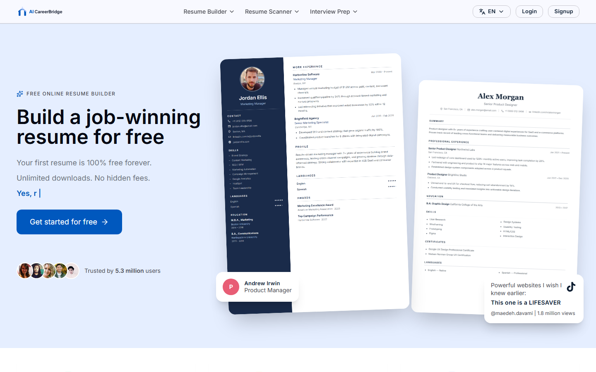
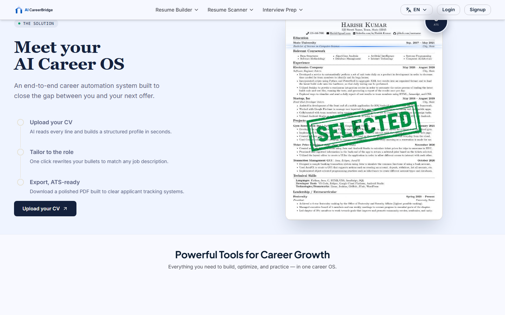
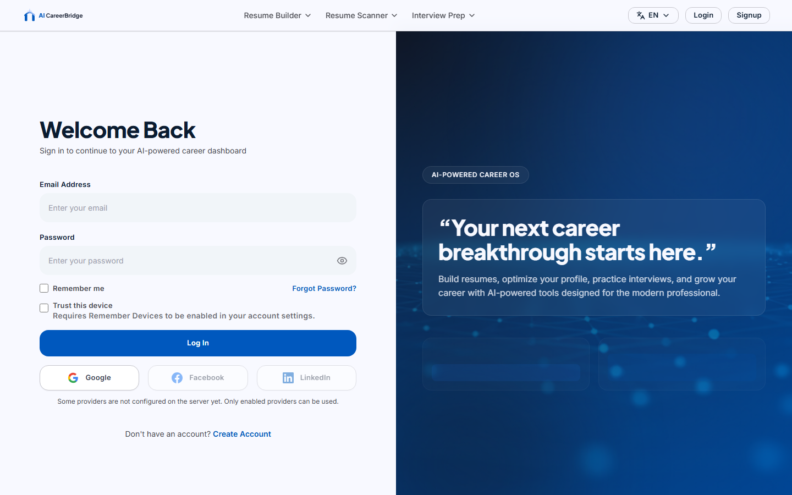
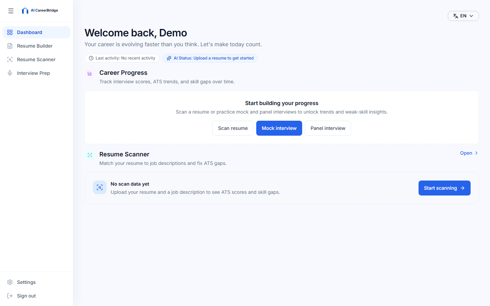
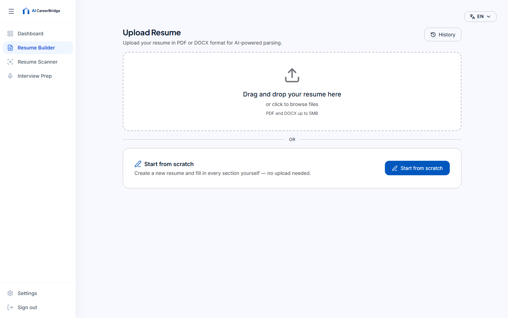
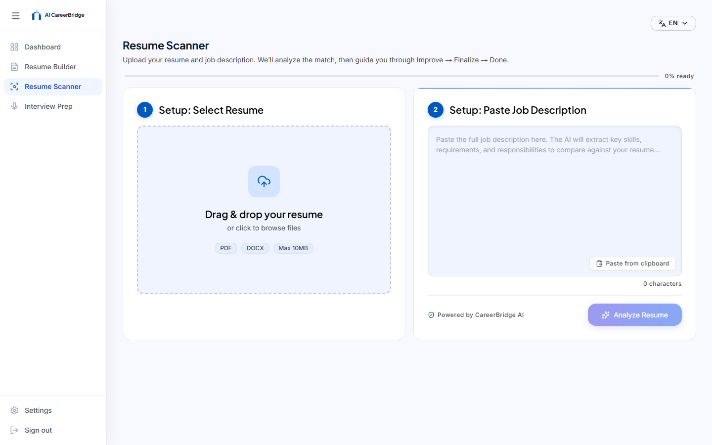
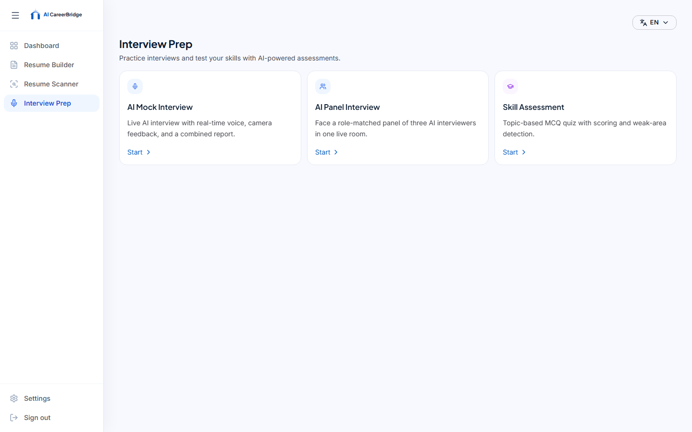
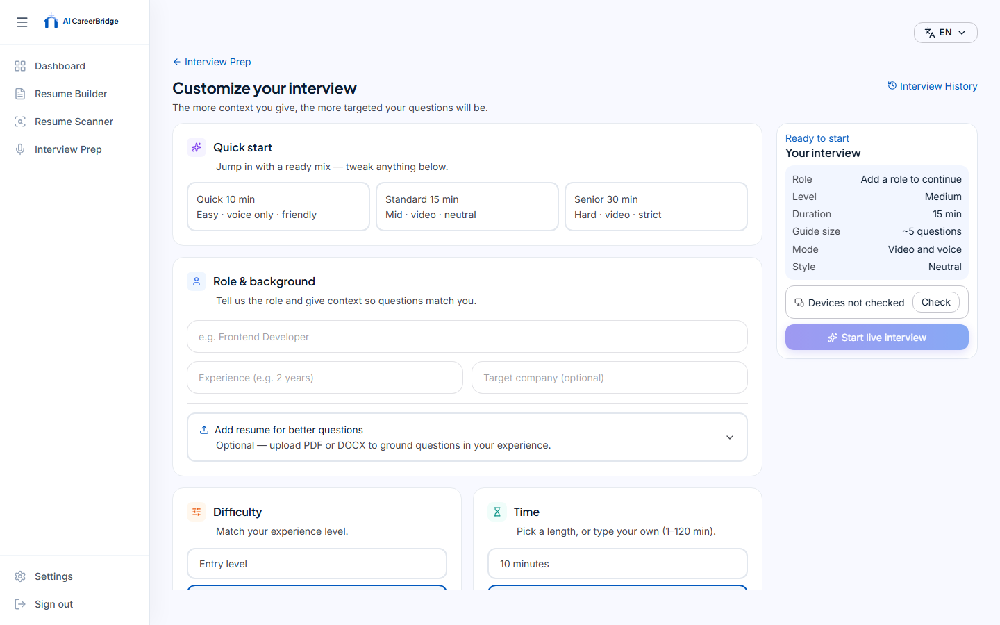
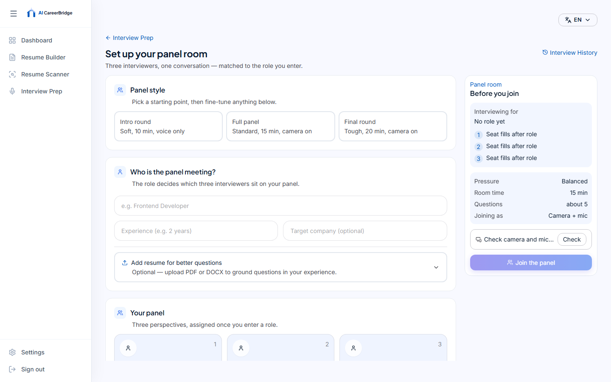
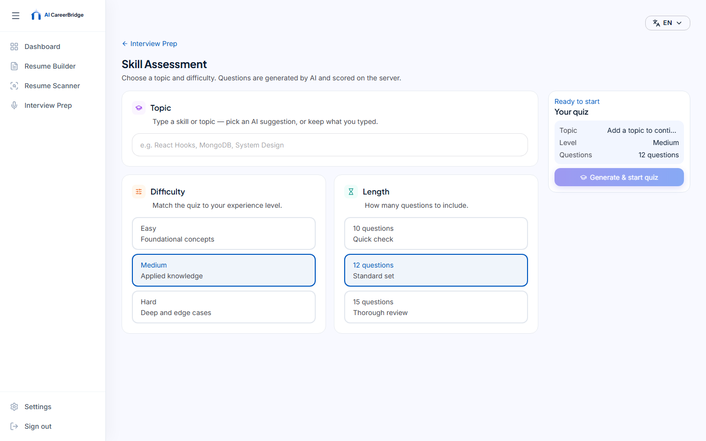

# AI CareerBridge

**AI-powered career OS** to build ATS-friendly resumes, scan them against real job descriptions, practice interviews with AI, and track progress — all in one platform.

[](https://github.com/zohaibchoudhry21-create/careerbridge)
[](#tech-stack)
[](#)

**Repository:** https://github.com/zohaibchoudhry21-create/careerbridge

---

## Table of contents

- [Screenshots](#screenshots)
- [Features](#features)
- [Architecture](#architecture)
- [Tech stack](#tech-stack)
- [Quick start](#quick-start)
- [Environment variables](#environment-variables)
- [Project structure](#project-structure)
- [Documentation](#documentation)
- [Demo account](#demo-account)
- [Scripts](#scripts)
- [Contributing / notes](#contributing--notes)

---

## Screenshots

Live UI captures from the running app (landing + core features):

### Landing & auth







### Dashboard



### Resume Builder



### Resume Scanner



### Interview Prep









> Re-capture locally with the app running: `node frontend/scripts/capture-feature-screenshots.mjs` (demo login: `demo@aicareerbridge.com` / `Demo@123456`).

---

## Features

### Resume Builder
- Upload PDF/DOCX or start from scratch
- AI parsing into structured sections (contact, summary, experience, education, skills, projects, …)
- Multi-template visual editor
- ATS-oriented text + PDF export
- Resume history and re-open/edit flows

### Resume Scanner
- Match your resume against a pasted job description
- ATS score + job-match score with skill coverage
- Keyword gaps, searchability tips, recruiter-oriented suggestions
- Accept / reject suggestions, undo/redo, optional rewrite gate
- Finalize and download an improved PDF
- Groq primary analysis with **fallback API key** + **Gemini cascade** for reliability

### Interview Prep
- **Mock interview** — live 1:1 voice session (Vapi), camera/presence signals, scored report + history
- **Panel interview** — multi-interviewer boardroom experience with role-matched panelists
- **Skill assessment** — AI-generated MCQ quizzes, server-side scoring, weak-area insights

### Dashboard & account
- Career progress (ATS / interview / quiz trends)
- Quick actions into Builder and Scanner
- Email/password auth, email verification, password reset
- Optional Google / Facebook / LinkedIn OAuth
- Optional 2FA (TOTP), sessions, data export / deactivate / delete
- Settings + appearance; i18n: **English / Spanish / Urdu**

---

## Architecture

```text
┌─────────────────┐     ┌──────────────────┐     ┌────────────────────┐
│  React (Vite)   │────▶│  Express API     │────▶│  MongoDB           │
│  :5173          │     │  :5000           │     │  ai-careerbridge   │
└─────────────────┘     └────────┬─────────┘     └────────────────────┘
                                 │
                    ┌────────────┼────────────┐
                    ▼            ▼            ▼
              FastAPI PDF     Groq /       Vapi
              extraction      Gemini /     (live voice)
              :8000           Claude
```

Three local processes run together via `npm run dev`:
1. **Frontend** — UI
2. **Backend** — auth, resumes, scanner jobs, interview sessions, reports
3. **Python service** — PDF/DOCX text extraction for uploads

---

## Tech stack

| Layer | Technologies |
|--------|----------------|
| Frontend | React 18, Vite 6, React Router 7, Tailwind CSS, TanStack Query, i18next, Chart.js, Motion/GSAP, Three.js / R3F, face-api.js, Vapi Web SDK |
| Backend | Node.js, Express, Mongoose, Passport (OAuth), JWT + cookies, Zod / validators, Multer, Helmet, rate limiting, Nodemailer, Vitest |
| Database | MongoDB |
| Python | FastAPI, Uvicorn, PyMuPDF / pdfplumber, OCR helpers, python-docx |
| AI | **Groq** (JSON analysis, quizzes, Whisper STT), **Gemini** (scanner/builder fallback), **Anthropic Claude** (optional), **Vapi** (live interviewer) |

---

## Quick start

### Prerequisites

- **Node.js 20+**
- **Python 3.11+** (venv under `python-service/`)
- **MongoDB** on `127.0.0.1:27017`

### Install

```bash
npm run install-all
```

### Environment

1. Copy examples to real env files:
   - `backend/.env.example` → `backend/.env`
   - `frontend/.env.example` → `frontend/.env` (if present)
   - `python-service/.env.example` → `python-service/.env` (if present)
2. Set at least `MONGO_URI`, `JWT_SECRET`, and matching `PYTHON_SERVICE_API_KEY` on backend + Python.
3. Add `GROQ_API_KEY` (and optionally `GROQ_API_KEY_FALLBACK`, `GEMINI_API_KEY`) for AI features.
4. Add `VAPI_PRIVATE_KEY` / `VITE_VAPI_WEB_TOKEN` for live mock interviews.

### Verify MongoDB

```bash
npm run test:db --prefix backend
```

### Seed demo user (optional)

```bash
npm run setup
```

### Run everything

```bash
npm run dev
```

| Service | URL |
|---------|-----|
| Frontend | http://localhost:5173 |
| Backend API | http://localhost:5000 |
| Python PDF service | http://localhost:8000 |

---

## Environment variables

Names only — never commit real secrets.

### Backend (`backend/.env`)

| Variable | Purpose |
|----------|---------|
| `PORT` | API port (default `5000`) |
| `MONGO_URI` | MongoDB connection string |
| `CLIENT_URL` / `API_URL` | CORS + absolute URL helpers |
| `JWT_SECRET` / `JWT_EXPIRE` | Auth tokens |
| `SMTP_*` / `EMAIL_FROM` | Email verification & reset |
| `GOOGLE_*` / `FACEBOOK_*` / `LINKEDIN_*` | Social OAuth |
| `GROQ_API_KEY` / `GROQ_API_KEY_FALLBACK` | Primary + fallback Groq orgs |
| `GROQ_MODEL` / `GROQ_FAST_MODEL` / `GROQ_WHISPER_MODEL` | Model selection |
| `GEMINI_API_KEY` / `GEMINI_MODEL` | Scanner/builder fallback |
| `ANTHROPIC_API_KEY` / `ANTHROPIC_MODEL` | Optional Claude path |
| `VAPI_PRIVATE_KEY` | Server-side live interview assistants |
| `PYTHON_SERVICE_URL` / `PYTHON_SERVICE_API_KEY` | PDF extraction service |

### Frontend

| Variable | Purpose |
|----------|---------|
| `VITE_API_URL` / `VITE_API_BASE_URL` | Backend base URL |
| `VITE_VAPI_WEB_TOKEN` | Browser Vapi client token |

### Python service

| Variable | Purpose |
|----------|---------|
| `PYTHON_SERVICE_API_KEY` | Must match backend |
| `PYTHON_SERVICE_CORS_ORIGINS` | Allowed origins |
| `PYTHON_SERVICE_MAX_UPLOAD_BYTES` / `PYTHON_SERVICE_MAX_PAGES` | Safety limits |

See `backend/.env.example` for the full template.

---

## Project structure

```text
careerbridge/
├── backend/                 # Express API (auth, resumes, scanner, interviews)
├── frontend/                # React + Vite app
├── python-service/          # FastAPI PDF/DOCX extraction
├── docs/                    # Architecture & how-it-works guides
│   └── screenshots/         # README images
├── scripts/                 # Repo helper scripts
├── package.json             # Monorepo: install-all, dev, setup
└── README.md
```

---

## Documentation

| Doc | Topic |
|-----|--------|
| [`docs/RESUME_SCANNER_HOW_IT_WORKS.md`](docs/RESUME_SCANNER_HOW_IT_WORKS.md) | Scanner pipeline, scoring, AI cascade |
| [`docs/INTERVIEW_PREP_HOW_IT_WORKS.md`](docs/INTERVIEW_PREP_HOW_IT_WORKS.md) | Mock / panel / skill assessment flows |
| Other files under [`docs/`](docs/) | Architecture & UX notes |

---

## Demo account

After `npm run setup`:

| Field | Value |
|-------|--------|
| Email | `demo@aicareerbridge.com` |
| Password | `Demo@123456` |

---

## Scripts

| Command | Description |
|---------|-------------|
| `npm run install-all` | Install root + backend + frontend deps |
| `npm run setup` | Seed demo user |
| `npm run dev` | Start Python + API + Vite together |
| `npm run build` | Production frontend build |
| `npm test` | Backend tests |
| `npm run check:social-auth` | Validate OAuth-related config |

---

## Contributing / notes

- This repo is an **FYP / portfolio** full-stack product — keep secrets out of git (use `.env`, never commit `.env`).
- Prefer small, focused PRs when extending scanner, interview, or auth modules.
- AI Optimize (experimental UI) was removed; resume optimization lives inside **Resume Scanner**.

---

## License / authorship

Final Year Project — **AI CareerBridge**  
GitHub: [zohaibchoudhry21-create/careerbridge](https://github.com/zohaibchoudhry21-create/careerbridge)
