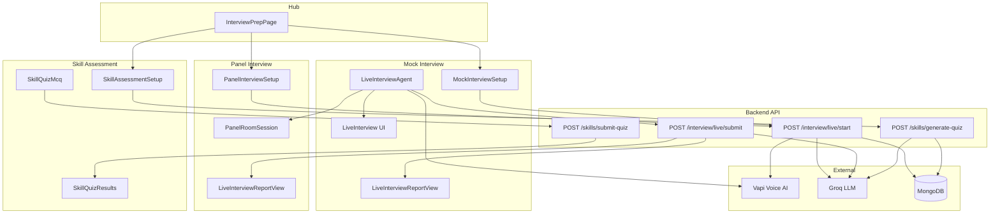

# Interview Prep — Feature Guide (Code + Working)

**Module:** Interview Prep only (Mock Interview, Panel Interview, Skill Assessment)  
**Stack:** React (Vite) · Express · MongoDB · Groq · Vapi  
**Purpose:** Yeh document batata hai ke Interview Prep feature **kya karta hai**, **kaun si files involved hain**, aur **code level par flow kaise chalta hai**.

---

## 1. Feature overview

Interview Prep teen alag practice modes deta hai:

| Mode | Route | Kya hota hai |
|------|-------|----------------|
| **AI Mock Interview** | `/interview-prep/mock` | 1-on-1 live voice/video interview — Vapi AI interviewer |
| **AI Panel Interview** | `/interview-prep/panel` | 3 panelists simulate karte hain (ek shared voice) — lobby → boardroom UI |
| **Skill Assessment** | `/interview-prep/skills` | Topic-based MCQ quiz — Groq questions generate, server score karta hai |

Hub page sab modes ka entry point hai:

```
/interview-prep  →  InterviewPrepHub  →  mock | panel | skills
```

---

## 2. Frontend routes

Routes `frontend/src/App.jsx` mein define hain. Sab `ProtectedRoute` ke andar hain (login required).

```jsx
// frontend/src/App.jsx (simplified)
<Route path="/interview-prep" element={<InterviewPrepPage />} />

<Route path="/interview-prep/skills" element={<SkillAssessmentSetupPage />} />
<Route path="/interview-prep/skills/:quizId" element={<SkillAssessmentQuizPage />} />

<Route path="/interview-prep/mock" element={<MockInterviewLayout />}>
  <Route index element={<MockInterviewSetupPage />} />
  <Route path="history" element={<MockInterviewHistoryPage />} />
  <Route path=":sessionId" element={<MockInterviewSessionPage />} />
</Route>

<Route path="/interview-prep/panel" element={<MockInterviewLayout />}>
  <Route index element={<PanelInterviewSetupPage />} />
  <Route path="history" element={<PanelInterviewHistoryPage />} />
  <Route path=":sessionId" element={<MockInterviewSessionPage />} />
</Route>
```

**Note:** Mock aur Panel **same session page** use karte hain (`MockInterviewSessionPage`). URL se detect hota hai ke panel hai ya mock:

```jsx
// frontend/src/pages/InterviewPrep/MockInterviewSessionPage.jsx
const isPanelRoute = location.pathname.includes('/interview-prep/panel');
const basePath = isPanelRoute ? '/interview-prep/panel' : '/interview-prep/mock';
```

`MockInterviewLayout` sirf shared camera/mic context deta hai:

```jsx
// frontend/src/pages/InterviewPrep/MockInterviewLayout.jsx
export default function MockInterviewLayout() {
  return (
    <InterviewMediaProvider>
      <Outlet />
    </InterviewMediaProvider>
  );
}
```

---

## 3. Folder structure (Interview Prep only)

```
frontend/src/
├── pages/InterviewPrep/
│   ├── InterviewPrepPage.jsx          # Hub
│   ├── MockInterviewLayout.jsx        # Media provider wrapper
│   ├── MockInterviewSetupPage.jsx
│   ├── PanelInterviewSetupPage.jsx
│   ├── MockInterviewSessionPage.jsx   # Live + report (mock & panel)
│   ├── MockInterviewHistoryPage.jsx
│   ├── PanelInterviewHistoryPage.jsx
│   ├── SkillAssessmentSetupPage.jsx
│   └── SkillAssessmentQuizPage.jsx
│
└── features/interviewPrep/
    ├── components/
    │   ├── InterviewPrepHub.jsx
    │   ├── MockInterviewSetup.jsx
    │   ├── PanelInterviewSetup.jsx
    │   ├── PanelRosterSection.jsx
    │   ├── LiveInterviewAgent.jsx     # Vapi orchestrator
    │   ├── LiveInterview.jsx          # 1-on-1 UI
    │   ├── panelRoom/                 # Panel-only UI
    │   │   ├── PanelRoomSession.jsx
    │   │   ├── PanelLobby.jsx
    │   │   ├── PanelBoardroomStage.jsx
    │   │   └── ...
    │   ├── LiveInterviewReportView.jsx
    │   ├── SkillAssessmentSetup.jsx
    │   └── SkillQuizMcq.jsx / SkillQuizResults.jsx
    ├── hooks/
    │   ├── useMockInterview.js
    │   ├── useSkillAssessment.js
    │   ├── useLiveInterview.js
    │   └── useFaceVideoAnalysis.js
    ├── services/
    │   ├── mockInterviewService.js
    │   └── skillAssessmentService.js
    ├── lib/vapi.sdk.js
    └── constants/interviewPrepConstants.js

backend/src/
├── routes/
│   ├── mockInterviewRoutes.js
│   └── skillQuizRoutes.js
├── controllers/
│   ├── mockInterviewController.js
│   └── skillQuizController.js
├── models/
│   ├── MockInterviewSession.js
│   ├── SkillQuiz.js
│   └── InterviewReport.js
└── utils/
    ├── vapiAssistantService.js
    ├── interviewerPersona.js
    ├── interviewerPromptBuilder.js
    └── panelPromptHelpers.js
```

---

## 4. Flow A — AI Mock Interview (1-on-1)

### 4.1 User journey

```
Hub → Setup (role, difficulty, duration, resume) → Start Live
  → Session page → Vapi call → End call → Submit → Report
```

### 4.2 Setup → API start

User `MockInterviewSetup` par role aur options select karta hai, phir **Start live interview**:

```jsx
// frontend/src/features/interviewPrep/components/MockInterviewSetup.jsx (concept)
const result = await startLiveInterview.mutateAsync({
  role: roleTrimmed,
  difficulty,
  durationMinutes,
  interviewFormat: 'standard',
  interviewerPersona,
  focusAreas,
  interviewMode, // 'video_voice' | 'voice_only'
  // optional: resumeText, resumeSkills, experience, targetCompany
});

navigate(`/interview-prep/mock/${result.sessionId}`, {
  state: { assistantId: result.assistantId, roleLabel, ... }
});
```

Frontend service:

```js
// frontend/src/features/interviewPrep/services/mockInterviewService.js
export const startLiveInterview = (payload) =>
  api.post('/interview/live/start', payload, { timeout: 120000 }).then(unwrap);
```

### 4.3 Backend: session + Vapi assistant

`POST /api/interview/live/start` → `startLiveInterview` in `mockInterviewController.js`:

1. Role validate / resolve karta hai  
2. `prepareInterviewIntelligence()` se question guide + context brief banata hai (Groq)  
3. `MockInterviewSession` MongoDB mein create hota hai  
4. `createVapiAssistantForSession(session)` — server-side Vapi assistant (system prompt **browser ko kabhi nahi milta**)  
5. Response: `{ sessionId, assistantId, panelSeats?, ... }`

```js
// backend/src/utils/vapiAssistantService.js (concept)
export const buildVapiAssistantPayload = (session) => {
  const systemPrompt = buildInterviewerSystemPrompt(session);
  const firstMessage = buildDynamicGreeting(session);
  return {
    name: `CareerBridge Interview ${sessionId}`,
    firstMessage,
    model: { messages: [{ role: 'system', content: systemPrompt }] },
    voice: { provider, voiceId, speed },
    // ...
  };
};
```

Persona prompt `interviewerPromptBuilder.js` + `interviewerPersona.js` se assemble hota hai (friendly / neutral / strict / panel).

### 4.4 Live call — `LiveInterviewAgent`

Session page lazy-load karta hai `LiveInterviewAgent`:

```jsx
// frontend/src/pages/InterviewPrep/MockInterviewSessionPage.jsx
const LiveInterviewAgent = lazy(
  () => import('../../features/interviewPrep/components/LiveInterviewAgent')
);
```

Agent Vapi client start karta hai:

```jsx
// frontend/src/features/interviewPrep/components/LiveInterviewAgent.jsx (concept)
import { getVapiClient, stopVapiCall } from '../lib/vapi.sdk';

// User clicks Start → vapi.start(assistantId)
// Events: call-start, message, speech-start/end, call-end, error
// useLiveInterview() merges transcript turns
// useFaceVideoAnalysis() + useLiveAudioMonitor() collect metrics (optional)
```

Mock format ke liye UI shell `LiveInterview.jsx` render hota hai; panel ke liye `PanelRoomSession.jsx`.

### 4.5 Submit → Report

Call khatam hone par frontend submit karta hai:

```js
// frontend/src/features/interviewPrep/services/mockInterviewService.js
export const submitLiveInterview = ({ sessionId, transcript, liveAudioHints, liveVideoMetrics, durationMs }) =>
  api.post('/interview/live/submit', {
    sessionId, transcript, liveAudioHints, liveVideoMetrics, durationMs,
  }, { timeout: 120000 }).then(unwrap);
```

Backend `submitLiveInterview`:

1. Transcript normalize + cap  
2. Voice / speech / video metrics aggregate  
3. Session `completed` mark  
4. `persistMockInterviewReport()` → Groq narrative + scores → `InterviewReport`  
5. Serialized report frontend ko  

UI: `LiveInterviewReportView` (score ring, dimensions, timeline, next steps).

---

## 5. Flow B — AI Panel Interview

Panel **mock ka extension** hai — same backend session engine, alag UI + persona.

### 5.1 Setup differences

```jsx
// frontend/src/features/interviewPrep/components/PanelInterviewSetup.jsx (concept)
await startLiveInterview.mutateAsync({
  role: roleTrimmed,
  difficulty,        // mapped as "panel pressure" (easy/medium/hard)
  durationMinutes,
  interviewFormat: 'panel',
  interviewerPersona: 'panel',
  focusAreas: themes, // panel themes → focusAreas on session
  interviewMode,
});

navigate(`/interview-prep/panel/${sessionId}`, { state: { ... } });
```

Panel seats preview:

```js
// GET /api/interview/panel/preview-seats?roleLabel=Software Engineer
// backend/src/utils/interviewerPersona.js → resolvePanelSeats(roleLabel)
```

Har seat object:

```js
{
  displayName: 'Alex',
  title: 'Technical lead',
  focus: 'depth, trade-offs, and how things were built',
  cue: 'From the tech side…',  // AI har turn is se shuru kare — UI speaker match ke liye
}
```

### 5.2 Panel live UI flow

```
PanelLobby (waiting room, 3 seat cards, shared-voice hint)
  → Enter room
  → PanelEnterTransition (connecting animation)
  → PanelBoardroomStage (3 tiles + candidate video)
  → Transcript sidebar
  → Leave → PanelLeaveInterstitial → Submit (same as mock)
```

`LiveInterviewAgent` format check:

```jsx
// frontend/src/features/interviewPrep/components/LiveInterviewAgent.jsx
if (interviewFormat === 'panel') {
  return <PanelRoomSession {...sharedLiveProps} />;
}
return <LiveInterview {...sharedLiveProps} />;
```

### 5.3 Active speaker detection

UI guess karta hai kaun panelist bol raha hai — transcript ke start mein `cue` ya name match:

```js
// frontend/src/features/interviewPrep/utils/panelSeatMatch.js
export const matchActivePanelSeatIndex = (seats, assistantText) => {
  const text = extractPanelMatchText(assistantText); // first ~120 chars
  // 1) match seat.cue
  // 2) match displayName
  // 3) match title
  // else -1 (sticky fallback last seat in PanelRoomSession)
};
```

Panel prompt (`buildPanelPrompt`) mandatory cue rules enforce karta hai taake UI sahi tile highlight kare.

---

## 6. Flow C — Skill Assessment (MCQ)

Vapi use **nahi** hota. Pure Groq + server scoring.

### 6.1 Generate quiz

```jsx
// frontend/src/features/interviewPrep/components/SkillAssessmentSetup.jsx
const result = await generateQuiz.mutateAsync({
  topic: trimmedTopic,
  difficulty,
  length: Number(length), // 10 | 12 | 15
});
navigate(`/interview-prep/skills/${result.quiz.quizId}`);
```

```js
// POST /api/skills/generate-quiz
// backend/src/utils/skillQuizGroqService.js → generateSkillQuizWithGroq()
// SkillQuiz model mein save — correctIndex client ko nahi bhejta (serializer)
```

### 6.2 Take quiz + submit

```jsx
// frontend/src/pages/InterviewPrep/SkillAssessmentQuizPage.jsx
const { data: quiz } = useSkillQuiz(quizId);
// User answers stored in local state `answers`
await submitQuiz.mutateAsync({
  quizId,
  answers: questions.map((q) => ({
    questionId: q.questionId,
    selectedIndex: answers[q.questionId],
  })),
});
// → SkillQuizResults (percentage, weakAreas, reviewList)
```

Scoring **pure server-side** (LLM nahi):

```js
// backend/src/utils/skillQuizScoring.js
export const scoreSkillQuiz = (questions, answers) => { /* compare selectedIndex vs correctIndex */ };
export const computeWeakAreas = (perQuestion) => { /* group by subtopic */ };
```

---

## 7. History & reports

| Page | Hook | API |
|------|------|-----|
| Mock history | `useInterviewSessionHistory({ interviewFormat: 'standard' })` | `GET /interview/sessions/history` |
| Panel history | `useInterviewSessionHistory({ interviewFormat: 'panel' })` | same, filtered |
| Saved report | `useSavedInterviewReport(sessionId)` | `GET /interview/report/:sessionId` |
| Regenerate | `useGenerateMockInterviewReport()` | `POST /interview/report` |

Completed session open karne par `MockInterviewSessionPage` report dikhata hai; active session par live agent.

---

## 8. Key MongoDB models

### MockInterviewSession (live mock + panel)

Important fields:

```js
{
  userId, role, roleLabel, difficulty,
  mode: 'live',
  status: 'setup' | 'active' | 'completed' | 'abandoned',
  interviewFormat: 'standard' | 'panel',
  interviewerPersona: 'friendly' | 'neutral' | 'strict' | 'panel',
  interviewMode: 'video_voice' | 'voice_only',
  durationMinutes, targetQuestionCount,
  questions: [{ questionId, text, order, focusTag, depthHint }],
  vapiAssistantId,
  voiceCallTranscript: [{ role, content }],
  panelSeats: [{ displayName, title, focus, cue }],
  callLiveAudioHints, callVoiceMetrics, callVideoMetrics,
  focusAreas, resumeText, experience, targetCompany,
  reportId,
}
```

File: `backend/src/models/MockInterviewSession.js`

### SkillQuiz

```js
{
  userId, topic, topicLabel, difficulty, questionCount,
  status: 'pending' | 'in_progress' | 'submitted',
  questions: [{ questionId, question, options, subtopic, correctIndex }],
  answers: [{ questionId, selectedIndex, isCorrect }],
  scoredResult: { score, total, percentage, weakAreas, reviewList },
}
```

File: `backend/src/models/SkillQuiz.js`

### InterviewReport (mock/panel only)

Enterprise-style report: overall score, dimensions, narrative, timeline, hiring signal.  
File: `backend/src/models/InterviewReport.js`  
Built by: `backend/src/services/interviewReport/`

---

## 9. Backend API summary

### Live interview (`/api/interview/...`)

| Method | Path | Purpose |
|--------|------|---------|
| POST | `/live/start` | Create session + Vapi assistant |
| POST | `/live/submit` | Transcript + metrics → report |
| POST | `/live/adaptive-depth` | Mid-call question depth nudge |
| GET | `/panel/preview-seats` | Role-matched 3 seats |
| POST | `/resume/analyze` | Setup resume parse |
| POST | `/role-suggestions` | Role autocomplete |
| GET | `/session/:sessionId` | Session detail |
| GET | `/sessions/history` | Paginated history |
| GET | `/report/:sessionId` | Saved report |
| POST | `/report` | Regenerate report |
| DELETE | `/session/:sessionId` | Delete session |

Routes file: `backend/src/routes/mockInterviewRoutes.js`

### Skill assessment (`/api/skills/...`)

| Method | Path | Purpose |
|--------|------|---------|
| GET | `/topics` | Configurable topic list |
| POST | `/generate-quiz` | Groq MCQ generation |
| GET | `/quiz/:quizId` | Quiz for client (no answers) |
| POST | `/submit-quiz` | Score + weak areas |

Routes file: `backend/src/routes/skillQuizRoutes.js`

---

## 10. Environment variables

| Variable | Where | Purpose |
|----------|-------|---------|
| `VITE_VAPI_WEB_TOKEN` | frontend `.env` | Browser joins Vapi call |
| `VAPI_PRIVATE_KEY` | backend `.env` | Server creates assistants |
| Groq keys | backend `.env` | Questions, report narrative, skill quiz |

Frontend check before start:

```js
// frontend/src/features/interviewPrep/lib/vapi.sdk.js
export const isVapiConfigured = () => Boolean(import.meta.env.VITE_VAPI_WEB_TOKEN);
```

---

## 11. End-to-end diagram (all three modes)



---

## 12. Important constants

File: `frontend/src/features/interviewPrep/constants/interviewPrepConstants.js`  
(mirror: `backend/src/constants/interviewPrepConstants.js`)

```js
export const INTERVIEW_FORMATS = { STANDARD: 'standard', PANEL: 'panel' };
export const MOCK_INTERVIEW_DIFFICULTIES = ['easy', 'medium', 'hard'];
export const INTERVIEWER_PERSONAS = ['friendly', 'neutral', 'strict', 'panel'];
export const INTERVIEW_SETUP_MODES = ['video_voice', 'voice_only'];

// Panel-specific
export const PANEL_PRESSURE_OPTIONS = [/* easy → soft, medium, hard → tough */];
export const PANEL_THEME_OPTIONS = [/* Case study, Behavioral, Coding, ... */];
export const PANEL_PRESETS = [/* intro 10min, standard 15min, tough 20min */];

// Skill quiz
export const MIN_SKILL_QUIZ_QUESTIONS = 10;
export const MAX_SKILL_QUIZ_QUESTIONS = 15;
```

Duration → question count (live guide size):

```js
// ~1 question per 3 minutes, clamped 4–16
export const durationMinutesToQuestionCount = (minutes) => { /* ... */ };
```

---

## 13. React Query hooks (frontend)

```js
// frontend/src/features/interviewPrep/hooks/useMockInterview.js
useStartLiveInterview()      // mutation → startLiveInterview
useSubmitLiveInterview()     // mutation → submitLiveInterview
useMockInterviewSession(id)  // query → fetchMockInterviewSession
useSavedInterviewReport(id)  // query → fetchSavedInterviewReport
useInterviewSessionHistory() // query → paginated history
usePreviewPanelSeats(role)   // query → panel seat preview
useDeleteInterviewSession() // mutation

// frontend/src/features/interviewPrep/hooks/useSkillAssessment.js
useGenerateSkillQuiz()
useSkillQuiz(quizId)
useSubmitSkillQuiz()
useSkillTopics()
```

---

## 14. Security & trust (short)

| Data | Client | Server |
|------|--------|--------|
| Interviewer system prompt | Never sent | Built in `vapiAssistantService` |
| Vapi private key | Never | `VAPI_PRIVATE_KEY` only |
| Vapi public token | `VITE_VAPI_WEB_TOKEN` | Join call only |
| MCQ correct answers | Hidden until submit | Stored on `SkillQuiz` |
| Report scores | Display | Clamped + validated server-side |

Detail: `docs/interview-prep-architecture.md`

---

## 15. Related docs

| File | Focus |
|------|--------|
| `docs/interview-prep-architecture.md` | Trust boundaries, sequence diagrams |
| `docs/INTERVIEW_SYSTEM_OPTIMIZATIONS.md` | Performance tuning |

---

## 16. Quick debug checklist

1. **Vapi not starting** — check `VITE_VAPI_WEB_TOKEN` (frontend) and `VAPI_PRIVATE_KEY` (backend).  
2. **Panel wrong speaker tile** — AI turn mein cue missing? Check `interviewerPersona.js` panel prompt.  
3. **No report after call** — network tab: `POST /interview/live/submit` success? Session `status: completed`?  
4. **Skill quiz empty** — Groq key + `POST /skills/generate-quiz` response.  
5. **History empty** — correct `interviewFormat` filter (`standard` vs `panel`).

---

*Last updated: Interview Prep module including Panel Live Realism (lobby hints, speaker banner, mandatory panel cues).*
